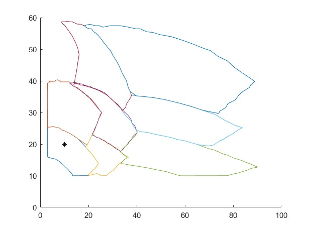
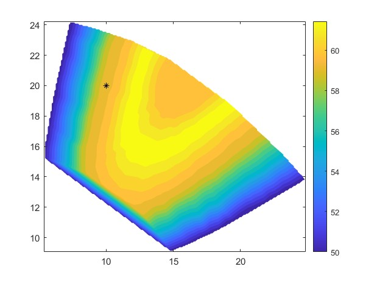

# Pump selection algorithm and hydro properties of several pumps

a pump selection algorithm based on catalog provided was developed as my fluid mechanics 1 course project.
also pump properties for several pumps and working flow rates are caculated in matlab  

## Features

### Pump Selection Algorithm

this project has implemented an algorithm to automate pump selection using digitized date from manufacturer catalogs.
the extracted data is processed and interpolated to selected a suitable pump and best operating condition.

<table>
  <tr>
    <td align="center">
      
       
      <strong>pump regions</strong>
    </td>
    <td align="center">
      
       
      <strong>interpolated efficiency map</strong>
    </td>
  </tr>
</table>

### Pump Performance Analysis

this project also includes calculation of pump properties both in S.I. units and english units including :

- **Pump efficacy and BEP**
- **Head gain**
- **Specific speed**

calculated data are plotted and approximated with polynomial curve fitting to ease plot analyzing and interpolation.

### Results Analysis

this project has a full review of the calculated results with data plots and tables you can download the report from link below
📄 [Download the review](finale.pdf)

## HOW TO RUN

1. open MATLAB file main.m
2. run the selection of the main.m you wish to see the results
   "this project has three section that should be run separately
   use run section for each of the datasets you wish to see"
